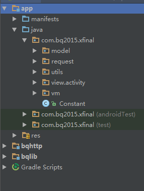
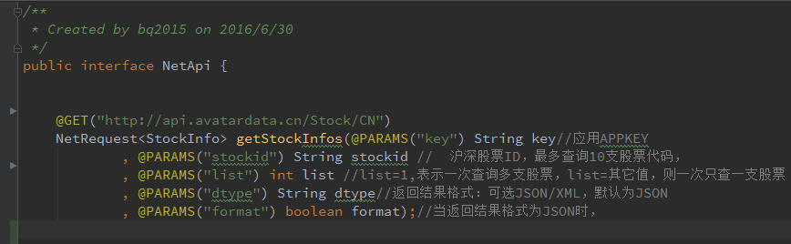

# XFinal#

> ## 采用MVVM架构，兼容MVP。 

项目包结构整洁明了：    

   

>##网络基于Okhttp3，采用retrofit形式使用。    

 
    
>##简单三步，快速掌握用法     

第一步：定义请求接口（提前写好封装服务器返回数据用的Bean）

     @CACHE(CacheMode.FIRST_CACHE_THEN_REQUEST) //先从缓存读取，再请求网络
    @GET("http://api.avatardata.cn/Stock/CN")
    NetRequest<StockInfo> getStockInfos(@PARAMS("key") String key  //应用APPKEY
            , @PARAMS("stockid") String stockid                    //	沪深股票ID，最多查询10支股票代码，
            , @PARAMS("list") int list                             //list=1,表示一次查询多支股票，
            , @PARAMS("dtype") String dtype                        //返回结果格式：可选JSON/XML，默认JSON
            , @PARAMS("format") boolean format);                   //当返回结果格式为JSON时，

第二步：在V层（View）,定义好更新UI控件的方法

     /**
     * Textview显示内容
     * @param content
     */
    public void setTextContent(String content) {
        mText.setText(content);
    }

第三步：在ViewModel层，调用网络请求接口，返回Bean，调用View层更新控件的方法，通过方法参数传递Bean中封装好数据信息    

       
        mStockInfoNetRequest = Net.get()
                .getStockInfos("b67e5efb0c78439e964c83a1ee752f4c", "hs002230", 1, "JSON", true)//网络接口
                .showProgress(mView,"正在加载...")//加载中状态
                .execute(new OnBQNetEventListener() { //执行并返回Bean
                    @Override
                    public void netRequestSuccess(BQNetEvent event) {
                        if (event.whoEqual(mStockInfoNetRequest)) {
                            mView.dissmissLoadingView();
                            StockInfo info = event.getNetResult();
                            //调用View层方法更新控件
                            mView.setTextContent(info.getResult().getMarket().getHSI().getName());
                        }
                    }

                    @Override
                    public boolean netRequestFail(BQNetEvent event) {
                        return false;
                    }
                });

备注：mView需在ViewModel层BindView方法中取值，mView = getView();